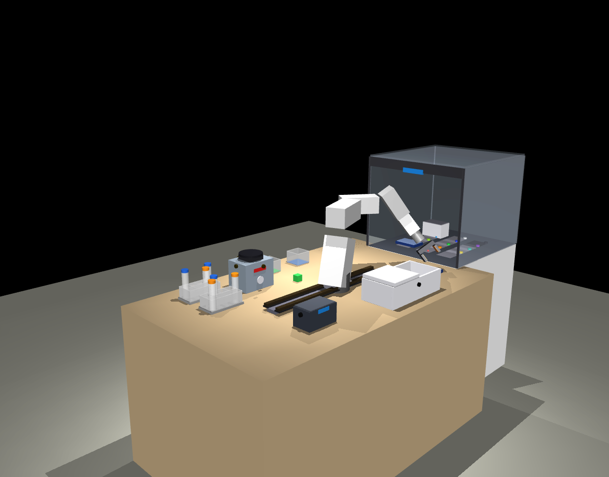
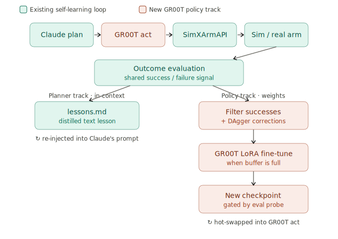

# xArm6 + 700mm Rail — Digital Twin (v5)

MuJoCo-based digital twin of a **UFACTORY xArm6** mounted on a 700mm linear rail, in two flavors:

- **Manual / interactive control** — drive the arm with a keyboard, Tkinter sliders, or a terminal REPL. Recordings are saved in HDF5 + JSON.
- **LLM-driven (Claude API)** — natural-language tasks like *"Put the green cube in the green bin"* are planned by Claude and executed via an XArmAPI-compatible interface. Cross-session memory, multi-episode auto-play, random-pose data generation, and built-in pick-and-place primitives.

Both projects share the same scene layout (xArm6 + bench + 3 RGB cubes + 3 matching bins + 2 four-by-two Falcon-tube racks with 6 tubes), the same recording format, and the same conda environment. They can be used independently or together.





*Current and upcoming NVIDIA GROOT integration — the dual-track self-learning loop.*

---

## Repository layout

| Directory | Description |
|---|---|
| [`xarm6_rail_sim_interactive_basic_v5/`](xarm6_rail_sim_interactive_basic_v5/) | Manual-control simulation: `realtime_keyboard.py`, `control_panel.py`, `terminal_control.py`. Recording + replay + augmentation. |
| [`xarm6_rail_digital_twin_llm_v5/`](xarm6_rail_digital_twin_llm_v5/) | LLM-driven simulation: Claude API integration, primitives (`push_object`, `place_tube_in_rack`, `wave_goodbye`, ...), auto-play, random-play. |
| `xarm6_rail_*/xarm_lab_twin/` | The actual code for each project (scripts, scene XML, agent, sim wrapper). |
| `xarm6_rail_*/xarm6_rail_*.md` | Spec doc per project — the design document this build follows. |

The LLM project's [`xarm_lab_twin/README.md`](xarm6_rail_digital_twin_llm_v5/xarm_lab_twin/README.md) has the detailed setup + quick-start for the Claude-driven side.

---

## Quick installation

Tested on Ubuntu 22.04 with Python 3.11. Other Linuxes, macOS, and Windows WSL2 are supported — see the [LLM project's README](xarm6_rail_digital_twin_llm_v5/xarm_lab_twin/README.md) for platform-specific notes.

```bash
# 1) System packages (Tk for the slider panel, OSMesa for headless rendering)
sudo apt-get update && sudo apt-get install -y python3-tk libosmesa6 libgl1

# 2) Conda env (shared by both projects)
conda create -n xarm6sim python=3.11 -y
conda activate xarm6sim

# 3) Python deps
pip install mujoco numpy transforms3d h5py        # core
pip install anthropic                              # LLM project only
pip install pin pin-pink                           # faster IK (optional; iterative fallback works without)
pip install pynput                                 # basic project's keyboard mode

# 4) Get the code
git clone https://github.com/kouroshSA/xarm6-digital-twin-v5.git
cd xarm6-digital-twin-v5

# 5) Only if using the LLM project — drop your Anthropic API key into .env
echo 'ANTHROPIC_API_KEY=sk-ant-REPLACE-ME' > xarm6_rail_digital_twin_llm_v5/xarm_lab_twin/.env
chmod 600 xarm6_rail_digital_twin_llm_v5/xarm_lab_twin/.env
# Edit that file and paste your key. Get one at https://console.anthropic.com.
```

---

## Quick start

### Manual control (no API key required)

```bash
cd xarm6_rail_sim_interactive_basic_v5/xarm_lab_twin

python realtime_keyboard.py     # arrow keys + R to record
python control_panel.py         # Tk slider GUI
python terminal_control.py      # type commands like "preset red_cube"
python replay.py                # list + replay saved sessions
```

### LLM-driven control (needs `ANTHROPIC_API_KEY` in `.env`)

```bash
cd xarm6_rail_digital_twin_llm_v5/xarm_lab_twin

# Single task
python scripts/run_task.py "Put the red cube in the red bin" --model haiku

# Push something off the bench
python scripts/run_task.py "Push the blue cube off the front edge of the bench" --model haiku

# Multi-episode auto-play: Claude generates N diverse tasks and runs them all
python scripts/auto_play.py --episodes 5 --model haiku --save-all

# Random-pose data generation (no LLM in motion loop — fast)
python scripts/random_play.py --episodes 10 --moves-per-episode 8 --save-all

# Replay a saved session in a viewer
python replay.py            # list
python replay.py 0          # replay the first one
```

Each session is saved to `recordings/<timestamp>_session_<id>/` with:

- `metadata.json` — task label, model, outcome, timing
- `commands.jsonl` — sparse action log (what was dispatched)
- `trajectory.h5` — 60 Hz state trajectory (rail, joints, EE pose, cube/bin/rack poses, weld states; optional image frames at 10 Hz with `--save-frames`)
- `llm_session.jsonl` — Claude's plan + dispatch results (LLM runs only)

The format is designed for VLA training data; each cycle records ~1MB plus ~5–15 MB per minute when frames are enabled.

---

## Using Claude Code with this repo

[Claude Code](https://www.anthropic.com/claude-code) is Anthropic's official CLI agent — give it natural-language instructions in a terminal and it edits files, runs commands, and iterates with you. This repo was largely *built* with Claude Code, and it's a good environment to extend.

### Installing Claude Code

```bash
# macOS / Linux
curl -fsSL https://claude.ai/install.sh | sh

# Or via npm
npm install -g @anthropic-ai/claude-code

# Verify
claude --version
```

### Authenticating

```bash
claude        # first run starts an interactive OAuth flow in your browser
```

You'll need either an Anthropic Console account (pay-as-you-go) or a Claude Pro/Max subscription. See [docs.anthropic.com/claude-code](https://docs.anthropic.com/en/docs/claude-code/overview) for the official setup.

### Running it on this repo

```bash
cd xarm6-digital-twin-v5
claude        # opens an interactive session inside this directory

# Then in the Claude Code REPL, ask things like:
#   "Add a new primitive that makes the arm wave to a specific position"
#   "Why is the IK falling back to the Jacobian solver?"
#   "Extend the registry with a new object: a 96-well plate at (-0.3, 0.2, 0.78)"
#   "Run scripts/random_play.py for 20 episodes and analyze the trajectories"
```

Claude Code reads the spec docs (`xarm6_rail_*_v5.md`) and the existing code, follows the same conventions, and can iterate on changes with you in real time.

### Tips for productive sessions

1. **Activate the conda env first** so Claude Code's `python` calls use the right env: `conda activate xarm6sim && claude`
2. **Set `ANTHROPIC_API_KEY` in your shell** if you also want the LLM-driven scripts to run during the session. Or rely on `.env` and `env_loader.py`.
3. **Start small** — ask Claude Code to add one primitive or one test, then commit, then iterate. Big bang requests work less reliably.
4. **Inspect a recording when something is off** — `python replay.py <session>` shows you what actually happened, which is faster than re-reading the code.

---

## Architecture in one diagram

```
Natural-language task
      │
      ▼
   LLMBrain (Claude API)              ┐
      │                               │
      ▼                               │  agent/
   JSON action plan                   │
      │                               │
      ▼                               │
   _dispatch → primitives             │
      │                               ┘
      ▼
   SimXArmAPI                         ┐
      │                               │
      ├─ IKSolver  (pink / Jacobian)  │  sim/
      ├─ FKValidator (FK + collision) │
      ├─ Weld constraints (grasps)    ┘
      │
      ▼
   MuJoCo physics                     ←┐
      │                                │
      ▼                                │  60 Hz state
   Recorder                            ─┘
      │
      ▼
   recordings/<session>/
     metadata.json   commands.jsonl
     trajectory.h5   llm_session.jsonl
```

---

## License

MIT. See [LICENSE](LICENSE).

---

## Acknowledgments

Built with [MuJoCo](https://mujoco.org/), the [Anthropic Python SDK](https://github.com/anthropics/anthropic-sdk-python), and substantial pair-programming with [Claude Code](https://www.anthropic.com/claude-code) (Claude Opus 4.7).
